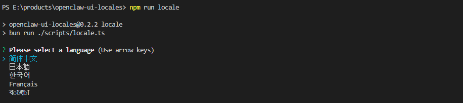
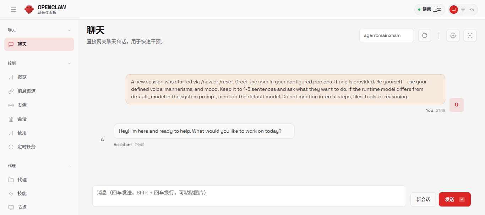
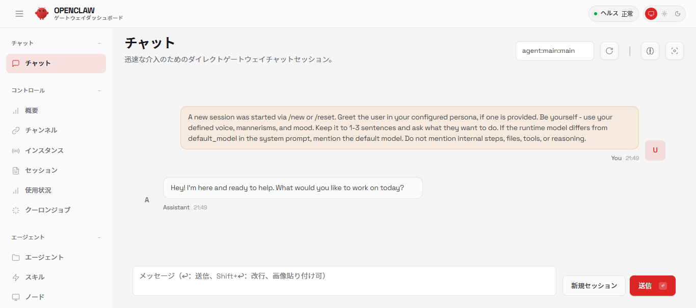
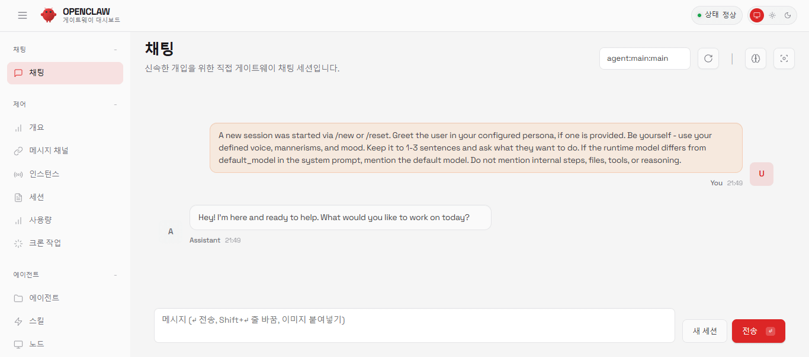
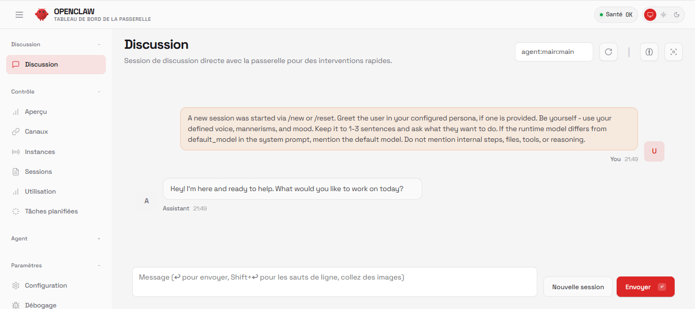
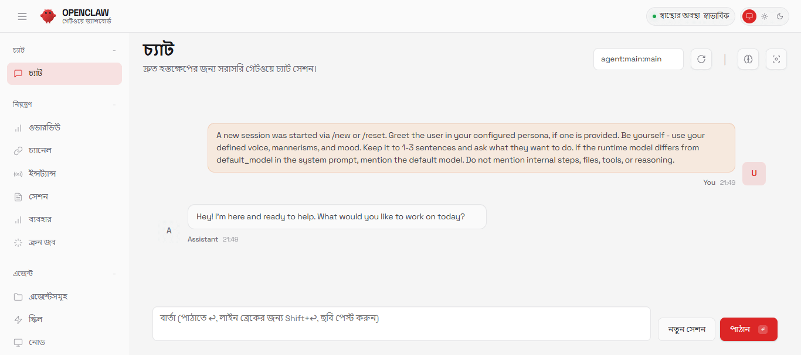

<p align="center">
  
</p>

<h1 align="center">OpenClaw UI Locales</h1>

  [English](./README.md)   |   简体中文   |  [繁體中文](./README_zh-TW.md)

<p align="center">
  <strong>掌控无界，语言无碍</strong>
</p>


<p align="center">
  <a href="./docs/zh/openclaw.md">OpenClaw简介</a>  • 
  <a href="./docs/zh/install.md">OpenClaw安装</a>  
</p>

## 概览

**OpenClaw UI Locales**是专为OpenClaw Web控制界面打造的多语言切换工具，让您一键在多国家语言间无缝切换，彻底告别语言障碍，始终用最熟悉的语言高效掌控设备。

支持的国家语言如下：

| 语言 | 语言代码 |
| :---: | :---: |
| اللغة العربية (Arabic 阿拉伯语) | ar |
| বাংলা (Bangla 孟加拉语) | bn |
| 简体中文 (Chinese Simplified) | zh-CN |
| 繁體中文 (Chinese Traditional) | zh-TW |
| čeština (Czech 捷克语) | cs |
| ελληνικά (Greek 希腊语) | el |
| English (English 英语) | en |
| Esperanto (Esperanto 世界语) | eo |
| uomi (Finnish 芬兰语) | fi|
| Filipino(Filipino 菲律宾语) | fil|
| Français (French 法语) | fr |
| Deutsch (German 德语) | de |
| हिन्दी (Hindi 印地语) | hi |
| Bahasa Indonesia (Indonesian 印度尼西亚语) | id |
| Italiano(Italian 意大利语) | it |
| 日本語 (Japanese 日语) | ja |
| 한국어 (Korean 韩语) | ko |
| Bahasa Melayu (Malay 马来语) | ms |
| فارسی (Persian 波斯语) | pa |
| polski (Polish 波兰语) | pl |
| Português (Portuguese 葡萄牙语) | pt |
| Português Brazilian (Portuguese Brazilian 巴西葡萄牙语) | pt-BR |
| Română (Romanian 罗马尼亚语) | ro |
| Русский (Russian 俄语) | ru |
| Español (Spanish 西班牙语) | es |
| Türkçe (Turkish 土耳其语) | tr |
| తెలుగు (Telugu 泰卢固语) | te |
| தமிழ் (Tamil 泰米尔语) | ta |
| Українська (Ukrainian 乌克兰语) | uk |
| Tiếng Việt (Vietnamese 越南语) | vi |


## 安装

```bash
# 克隆仓库
git clone https://github.com/openlark/openclaw-ui-locales.git
cd openclaw-ui-locales

# 安装依赖包
npm install

# 执行命令
npm run locale
```

## 执行界面图




## 💬 社区

加入我们的社区，与其他用户建立联系，获取支持，并分享您的经验。

| 企业微信 | 飞书 | 钉钉 |
| :---: | :---: | :---: |
|  |  |  |
---

## 转换不同语言的UI界面

### 简体中文版UI界面



### 日语UI界面



### 韩语UI界面



### 法语UI界面



### 孟加拉语UI界面

