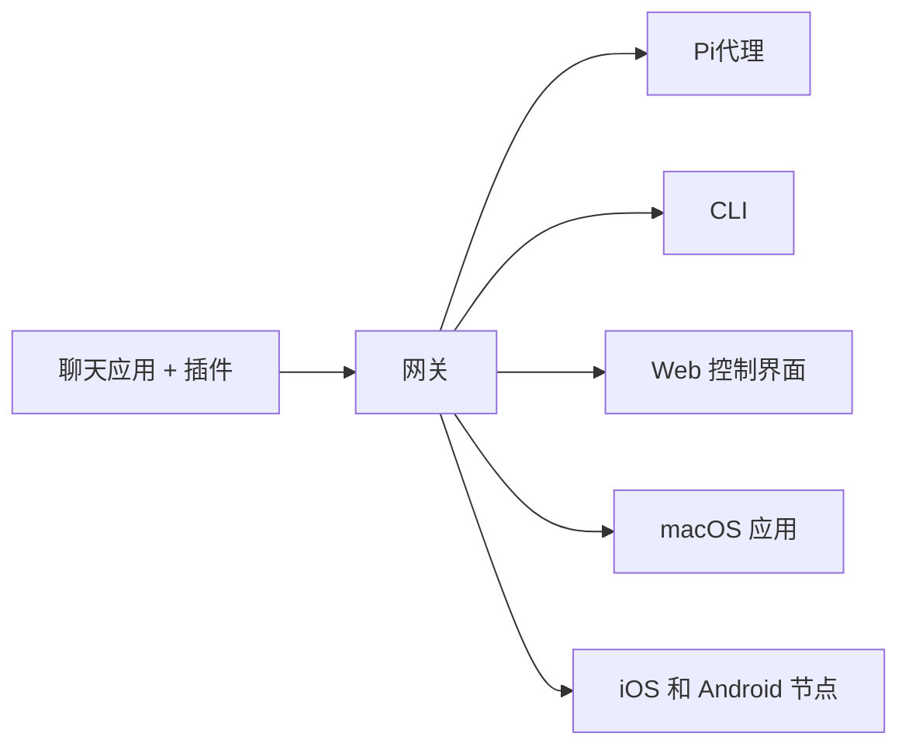

# OpenClaw 🦞

[OpenClaw](https://openclaw.ai) 真正能做事的人工智能。您的跨平台个人助手。适用于任何操作系统的 AI 智能体 Gateway 网关，支持 WhatsApp、Telegram、Discord、iMessage 等。

发送消息，随时随地获取智能体响应。通过插件可添加 Mattermost 等更多渠道。

OpenClaw 通过单个 Gateway 网关进程将聊天应用连接到 Pi 等编程智能体。它为 OpenClaw 助手提供支持，并支持本地或远程部署。

# 工作原理

Gateway 网关是会话、路由和渠道连接的唯一事实来源。

# 核心功能

**多渠道 Gateway 网关**

通过单个 Gateway 网关进程连接 WhatsApp、Telegram、Discord 和 iMessage。

**插件渠道**

通过扩展包添加 Mattermost 等更多渠道。

**多智能体路由**

按智能体、工作区或发送者隔离会话。

**媒体支持**

发送和接收图片、音频和文档。

**Web 控制界面**

浏览器仪表板，用于聊天、配置、会话和节点管理。

**移动节点**

 配对 iOS 和 Android 节点，支持 Canvas。
