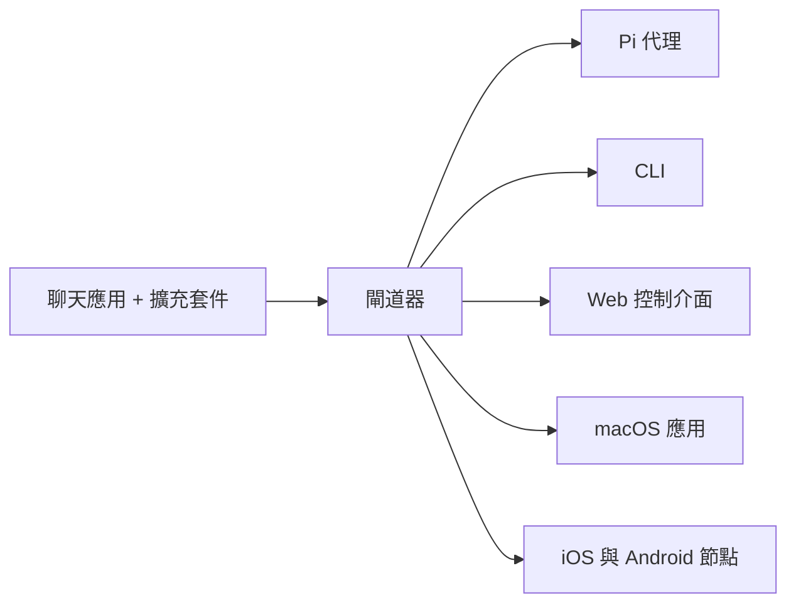

# OpenClaw 🦞

[OpenClaw](https://openclaw.ai) 真正能做事的人工智慧。您的跨平台個人助手。適用於任何作業系統的 AI 智能體 Gateway 閘道器，支援 WhatsApp、Telegram、Discord、iMessage 等。

發送訊息，隨時隨地獲取智能體回應。透過擴充套件可加入 Mattermost 等更多管道。

OpenClaw 透過單一 Gateway 閘道器程序將聊天應用連接到 Pi 等程式化智能體。它為 OpenClaw 助手提供支援，並支援本地或遠端部署。

# 運作原理

Gateway 閘道器是對話、路由與管道連接的唯一事實來源。

# 核心功能

**多管道 Gateway 閘道器**

透過單一 Gateway 閘道器程序連接 WhatsApp、Telegram、Discord 與 iMessage。

**擴充套件管道**

透過擴充套件包加入 Mattermost 等更多管道。

**多智能體路由**

按智能體、工作區或發送者隔離對話。

**媒體支援**

發送與接收圖片、音訊與文件。

**Web 控制介面**

瀏覽器儀表板，用於聊天、設定、對話與節點管理。

**行動節點**

配對 iOS 與 Android 節點，支援 Canvas。